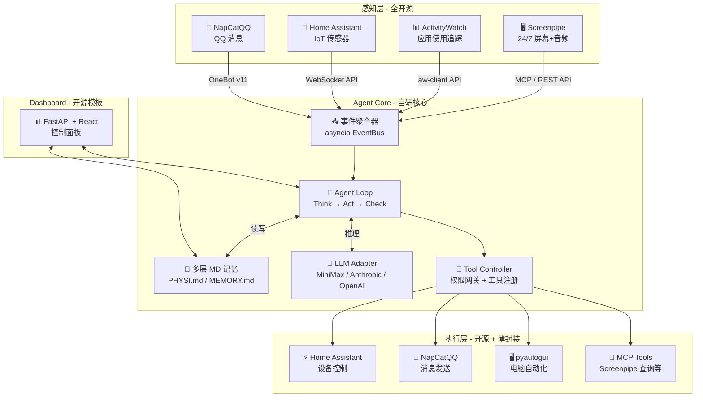

# PhysiBot — 从 QQBot 到物理世界 Agent 规划 (v3.0)

> **核心哲学**：模仿 Claude Code 的架构精髓 —— 用多层 Markdown 记忆 + Agent Loop + 开源生态整合，打造一个走出屏幕的自主 Agent。不造轮子，不绑框架，只写胶水。

---

## 00 · 市场调研结论 (Market Research)

### 🖥️ 桌面感知/监控

| 项目 | Stars | 特点 | 评估 |
|:---|:---:|:---|:---|
| **Screenpipe** | 16k+ | 24/7 屏幕+音频捕获，本地 SQLite，内建 OCR，**原生 MCP Server**，插件架构("Pipes") | ✅ **首选** |
| ActivityWatch | 12k+ | 隐私优先时间追踪，窗口/应用使用统计，Python API (`aw-client`) | ✅ **补充** |
| Windrecorder | 5k+ | Windows 专属记忆搜索，变化驱动截图 | ⚠️ 备选 |

**决策**：**Screenpipe** 为主 + **ActivityWatch** 为辅。

### 🏠 IoT / 智能家居控制

| 项目 | Stars | 特点 | 评估 |
|:---|:---:|:---|:---|
| **Home Assistant** | 75k+ | 最大开源智能家居平台，2000+ 品牌，REST/WebSocket API | ✅ **首选** |
| openHAB | 4k+ | Java, 极致稳定 | ⚠️ 过重 |
| Domoticz | 3k+ | 轻量但社区萎缩 | ❌ 不推荐 |

**决策**：直接集成 **Home Assistant**，绝不自己写设备驱动。

### 💬 QQ 通信层

| 项目 | 状态 | 评估 |
|:---|:---|:---|
| **NapCatQQ** | 活跃维护，NTQQ 协议，WebSocket/HTTP API | ✅ **首选** |
| Lagrange.Core | 2025.10 已归档 | ❌ 停止维护 |

**决策**：**NapCatQQ** + OneBot v11 标准协议。

### 🤖 Agent 架构参考

| 项目 | 启发 | 我们的做法 |
|:---|:---|:---|
| **Claude Code（泄露架构）** | 多层 MD 记忆、Agent Loop、权限网关、子 Agent 委派 | ✅ **核心参考** — 模仿其架构精髓 |
| LangGraph | 图编排状态机 | ❌ **不使用** — 过重，我们自建轻量 Agent Loop |
| CrewAI / AutoGen | 多 Agent 对话 | ❌ 不需要 |

**决策**：不使用任何 Agent 框架。参考 Claude Code 泄露架构，自建轻量级 **Think → Act → Check → Repeat** Agent Loop + **多层 MD 记忆系统**。

### 🧠 LLM 接入

| 提供商 | 接入方式 | 项目中实际使用 |
|:---|:---|:---|
| **MiniMax** | Anthropic SDK 兼容 (`api.minimaxi.com/anthropic`) 或 OpenAI SDK 兼容 (`api.minimax.io/v1`) | ✅ **项目默认** |
| Anthropic | 原生 Anthropic SDK | ✅ 供客户选择 |
| OpenAI | 原生 OpenAI SDK | ✅ 供客户选择 |
| 其他兼容 API | 只要兼容 OpenAI/Anthropic 协议即可 | ✅ 自动兼容 |

**决策**：设计统一的 LLM 适配层。用户只需在配置中指定：
```yaml
llm:
  provider: "minimax"          # minimax / anthropic / openai
  model: "MiniMax-M2.7"        # 具体型号
  api_key: "sk-xxx"            # API Key
  base_url: ""                 # 留空则使用默认，也可自定义
```

MiniMax 的独特优势：
- 同时兼容 Anthropic SDK 和 OpenAI SDK 协议
- MiniMax-M2.7 支持交错思维链（Interleaved Thinking）
- 支持 Function Calling / Tool Use
- 国内访问延迟低、成本友好

---

## 01 · 核心架构：模仿 Claude Code (Architecture)

> 2026 年 3 月 Claude Code 源码泄露揭示了生产级 Agent 的核心秘密：**护城河不在模型，而在 Harness（编排、记忆、安全）**。我们完整借鉴这一思路。

### Agent Loop（核心循环）

```
┌─────────────────────────────────────────────────┐
│              PhysiBot Agent Loop                │
│                                                 │
│  ┌──────────┐                                   │
│  │  感知    │ ← Screenpipe / AW / HA / QQ 事件  │
│  └────┬─────┘                                   │
│       ▼                                         │
│  ┌──────────┐                                   │
│  │  思考    │ ← 加载 MD 记忆 → 调用 LLM 推理    │
│  └────┬─────┘                                   │
│       ▼                                         │
│  ┌──────────┐    ┌────────────────┐             │
│  │  行动    │───→│ 需要工具调用？ │             │
│  └────┬─────┘    └───┬────────┬───┘             │
│       │          Yes │        │ No              │
│       │              ▼        ▼                 │
│       │    ┌──────────────┐  ┌────────┐         │
│       │    │ 执行工具     │  │ 输出   │         │
│       │    │ (MCP/HA/QQ)  │  │ 完成   │         │
│       │    └──────┬───────┘  └────────┘         │
│       │           │                             │
│       │           ▼                             │
│       │    ┌──────────────┐                     │
│       │    │ 检查结果     │                     │
│       │    │ 反馈到上下文 │                     │
│       │    └──────┬───────┘                     │
│       │           │                             │
│       └───────────┘  ← 循环直到任务完成         │
│                                                 │
│  ⚠️ 高危操作 → 人工确认节点（QQ 推送确认）      │
│  💾 每轮结束 → 自动写入 MD 记忆                 │
└─────────────────────────────────────────────────┘
```

**核心实现**（Python 伪代码）：

```python
async def agent_loop(initial_input, context):
    """Claude Code 风格的 Agent 主循环"""
    messages = build_messages(
        system=load_system_prompt(),       # 加载 PHYSI.md + 行为指令
        memory=load_memory_index(),         # 加载 MEMORY.md 索引
        context=context,                    # 感知层数据
        user_input=initial_input
    )

    while True:
        # 1. 思考 — 调用 LLM
        response = await llm_client.chat(messages)

        # 2. 检查 — 是否需要工具调用
        if response.has_tool_calls():
            for tool_call in response.tool_calls:
                # 权限检查
                if is_dangerous(tool_call) and not await user_confirm(tool_call):
                    result = "用户拒绝执行此操作"
                else:
                    result = await execute_tool(tool_call)

                # 反馈结果到上下文
                messages.append(tool_result(tool_call, result))
            continue  # 继续循环

        # 3. 完成 — 纯文本响应，退出循环
        final_response = response.text
        break

    # 4. 记忆 — 更新 MD 记忆文件
    await update_memory(messages, final_response)
    return final_response
```

### 多层 MD 记忆系统（核心创新）

直接借鉴 Claude Code 的三层记忆架构，用纯 Markdown 文件实现持久化记忆：

```
physi-data/
├── PHYSI.md                    # Layer 1: 核心指令（类比 CLAUDE.md）
├── MEMORY.md                   # Layer 2: 记忆索引（轻量指针）
├── memory/                     # Layer 3: 主题记忆文件
│   ├── user_preferences.md     # 用户偏好
│   ├── device_topology.md      # 设备拓扑
│   ├── daily_patterns.md       # 日常行为模式
│   ├── conversation_styles.md  # 对话风格学习
│   ├── iot_scenes.md           # IoT 场景配置
│   └── error_learnings.md      # 错误经验教训
└── transcripts/                # 会话摘要存档
    ├── 2026-04-05.md
    └── ...
```

#### Layer 1: `PHYSI.md` — 核心指令（始终加载）

```markdown
# PhysiBot 核心指令

## 身份
你是 PhysiBot，一个能感知用户电脑操作和物理环境的自主 Agent。
你通过 QQ 与用户交流，像朋友而非助手。

## 行为准则
- 不要频繁打扰用户，通过 Bandit 算法学习介入时机
- 高危操作（IoT 控制、电脑自动化）必须请求用户确认
- 记忆是提示而非真理，行动前务必验证当前状态
- 用中文回复，语气自然亲切

## 可用工具
- screenpipe_search: 查询用户屏幕历史
- aw_query: 查询应用使用统计
- ha_control: 控制智能家居设备
- ha_query: 查询设备状态
- qq_send: 发送 QQ 消息
- memory_read: 读取特定记忆主题文件
- memory_write: 写入/更新记忆

## 绝不做的事
- 绝不在未确认时删除文件或关闭应用
- 绝不主动查看屏幕中的密码/银行信息
- 绝不将用户数据发送到外部（LLM API 请求除外）
```

#### Layer 2: `MEMORY.md` — 记忆索引（始终加载，~150 字符/条）

```markdown
# 记忆索引

## 用户偏好
→ memory/user_preferences.md
用户喜欢暗色模式，工作时不希望被打扰，午休时间 12:00-13:30

## 设备拓扑
→ memory/device_topology.md
客厅: Yeelight 吸顶灯 x1, 小米温湿度计 x1; 书房: 智能插座 x1

## 日常模式
→ memory/daily_patterns.md
通常 9:00 开始工作(VSCode), 12:00 午休, 14:00 恢复, 22:00 后切换娱乐

## 对话风格
→ memory/conversation_styles.md
用户偏好简洁回复，讨厌表情包轰炸，接受偶尔的幽默
```

#### Layer 3: 主题文件（按需加载）

Agent 在推理时通过 `memory_read` 工具按需读取具体主题文件，不一次性全部加载，控制 token 消耗。

#### 记忆生命周期

```
新信息产生 → Agent 判断是否值得记忆
    ↓ Yes
写入对应主题文件 (memory_write)
    ↓
更新 MEMORY.md 索引摘要
    ↓
【空闲时】AutoConsolidate: 合并重复、修剪矛盾、压缩过旧条目
```

---

## 02 · 统一 LLM 适配层 (LLM Adapter)

核心设计：一个薄适配层，让用户只需配置 provider + model + api_key。

```python
# llm_adapter.py — 统一 LLM 调用接口

from dataclasses import dataclass

@dataclass
class LLMConfig:
    provider: str       # "minimax" | "anthropic" | "openai"
    model: str          # "MiniMax-M2.7" | "claude-sonnet-4-20250514" | "gpt-4o"
    api_key: str
    base_url: str = ""  # 留空使用默认

# 提供商默认配置
PROVIDER_DEFAULTS = {
    "minimax": {
        "sdk": "anthropic",  # MiniMax 推荐使用 Anthropic SDK
        "base_url": "https://api.minimaxi.com/anthropic",
    },
    "minimax_openai": {
        "sdk": "openai",
        "base_url": "https://api.minimax.io/v1",
    },
    "anthropic": {
        "sdk": "anthropic",
        "base_url": "https://api.anthropic.com",
    },
    "openai": {
        "sdk": "openai",
        "base_url": "https://api.openai.com/v1",
    },
}

class LLMClient:
    """统一 LLM 客户端，屏蔽提供商差异"""

    def __init__(self, config: LLMConfig):
        defaults = PROVIDER_DEFAULTS[config.provider]
        base_url = config.base_url or defaults["base_url"]

        if defaults["sdk"] == "anthropic":
            import anthropic
            self.client = anthropic.Anthropic(
                api_key=config.api_key,
                base_url=base_url,
            )
            self._mode = "anthropic"
        else:
            from openai import OpenAI
            self.client = OpenAI(
                api_key=config.api_key,
                base_url=base_url,
            )
            self._mode = "openai"

    async def chat(self, messages, tools=None):
        """统一的聊天接口，返回标准化响应"""
        if self._mode == "anthropic":
            return await self._call_anthropic(messages, tools)
        else:
            return await self._call_openai(messages, tools)
```

---

## 03 · 修订后的系统架构图 (System Diagram)



---

## 04 · 七层架构 → 开源映射

| 层级 | 名称 | 原规划 v2 | v3 调整 | 我们写什么 |
|:---:|:---:|:---|:---|:---|
| L1 | 感知层 | Screenpipe + AW | ✅ 不变 | Screenpipe Pipe 插件 |
| L2 | 存储层 | ChromaDB + SQLite | **多层 MD 文件** + Screenpipe SQLite | MD 读写逻辑 |
| L3 | 理解层 | Ollama + LangChain | **LLM Adapter** (MiniMax API) | 统一适配层 ~200 行 |
| L4 | 决策层 | ~~LangGraph~~ + MABWiser | **自研 Agent Loop** + MABWiser | Agent Loop ~400 行 |
| L5 | 编排层 | MCP 生态 | MCP + 自研 Tool Controller | 工具注册 + 权限 ~300 行 |
| L6 | 通信层 | HA + NapCatQQ | ✅ 不变 | 消息路由 ~300 行 |
| L7 | 执行层 | HA + pyautogui | ✅ 不变 | 执行确认 ~200 行 |

### v2 → v3 关键变化

| 维度 | v2（上一版） | v3（本版） |
|:---|:---|:---|
| Agent 框架 | LangGraph（重型图框架） | **自研 Agent Loop**（~400 行，Claude Code 风格） |
| 记忆系统 | ChromaDB 向量数据库 | **多层 MD 文件**（纯文本，git 友好，人可读） |
| LLM 推理 | Ollama 本地部署 | **云 API 适配层**（MiniMax/Anthropic/OpenAI） |
| 总依赖 | 10+ 重型开源项目 | 5 个核心开源项目 + 纯 Python 胶水 |

---

## 05 · 开发路线图 (Revised Roadmap)

### Phase 1 · Agent Core + 记忆系统 (第 1-2 周)

**目标**：搭建 Claude Code 风格的核心引擎

- [ ] 实现 **LLM Adapter**：
  - MiniMax（Anthropic SDK 兼容，`base_url=https://api.minimaxi.com/anthropic`）
  - Anthropic / OpenAI 原生支持
  - 统一的 `chat()` + `tool_call()` 接口
- [ ] 实现 **多层 MD 记忆系统**：
  - `PHYSI.md` 核心指令加载
  - `MEMORY.md` 索引管理
  - `memory/` 主题文件的按需读写
  - 记忆合并（AutoConsolidate）
- [ ] 实现 **Agent Loop**：
  - Think → Act → Check → Repeat 循环
  - 工具调用解析 + 结果反馈
  - 高危操作拦截 + 人工确认
- [ ] 实现 **Tool Controller**：
  - 工具注册表（JSON Schema 声明）
  - 权限分级（safe / confirm / deny）
  - 工具执行 + 错误处理

**产出**：一个可以通过命令行对话的 Agent，具备记忆能力和工具调用能力

### Phase 2 · 感知接入 + QQ 对接 (第 3-4 周)

**目标**：接入外部感知源，让 Agent "看得到" + "聊得到"

- [ ] 安装配置 **Screenpipe** → 对接其 REST API / MCP Server
- [ ] 安装配置 **ActivityWatch** → 对接 aw-client
- [ ] 注册感知工具到 Tool Controller：
  - `screenpipe_search` — 查询屏幕历史
  - `screenpipe_recent` — 获取最近上下文
  - `aw_query` — 查询应用使用统计
- [ ] 接入 **NapCatQQ**（OneBot v11 WebSocket）
- [ ] 实现 QQ 消息 → Agent Loop 的完整链路
- [ ] 实现主动推送（Agent 检测到值得通知的事件 → QQ 通知用户）
- [ ] 用 **MABWiser** 实现介入时机的探索-利用

**产出**：QQ 上的智能助手，能查询你的电脑操作历史并智能回复

### Phase 3 · IoT 接入 + 跨域联动 (第 5-6 周)

**目标**：通过 Home Assistant 接入物理世界

- [ ] 部署 **Home Assistant**（Docker / HAOS）
- [ ] 接入示范设备（智能灯、温湿度传感器、智能插座）
- [ ] 注册 IoT 工具到 Tool Controller：
  - `ha_list_devices` — 列出设备
  - `ha_get_state` — 获取状态
  - `ha_call_service` — 调用服务（开灯/关灯/调温等）
  - `ha_subscribe` — 订阅设备事件
- [ ] 实现跨域联动场景：
  - 🎯 久坐提醒：Screenpipe 检测久未离开 → 调亮灯光 + QQ 提醒
  - 🎯 会议模式：检测到 Zoom → 自动调暗灯 + 静音提醒
  - 🎯 离开检测：AW 无操作 → 关闭非必要设备
- [ ] 联动记忆：Agent 学习用户的场景偏好并写入 `memory/iot_scenes.md`

**产出**：AI 能同时理解数字行为 + 物理环境，并做出联动响应

### Phase 4 · Dashboard + 部署 (第 7-8 周)

**目标**：可视化管控 + 一键部署

- [ ] 基于 **FastAPI + React** 搭建 Dashboard
- [ ] 核心面板：
  - 活动时间线（Screenpipe + AW 数据聚合）
  - 设备控制面板（HA API 代理）
  - Agent 决策日志（Agent Loop 历史）
  - 记忆浏览器（浏览/编辑 MD 记忆文件）
  - 隐私控制（采集开关、数据清理）
  - LLM 配置（provider / model / api_key 设置）
- [ ] Docker Compose 一键部署
- [ ] 数据导出/导入（标准化 JSON）

### Phase 5 · 打磨 + 开源发布 (第 9-10 周)

- [ ] 完整文档（README、Architecture Guide、Memory Guide）
- [ ] 录制全链路 Demo 视频
- [ ] GitHub 仓库整理（MIT License）
- [ ] 技术解说发布（知乎/B站/V2EX）

---

## 06 · 技术栈清单 (Tech Stack)

### 开源依赖

```
# 感知层
screenpipe              # 24/7 屏幕感知 (MIT, 16k+ ⭐)
activitywatch            # 应用使用追踪 (MPL-2.0, 12k+ ⭐)

# LLM（云 API，不部署本地模型）
anthropic                # Anthropic SDK — 用于 MiniMax + Anthropic
openai                   # OpenAI SDK — 用于 OpenAI + 兼容 API

# 决策
mabwiser                 # 多臂老虎机算法 (Apache-2.0)

# 通信层
homeassistant-api        # Home Assistant Python 客户端
napcat                   # QQ 协议适配 (NapCatQQ + OneBot v11)

# Dashboard
fastapi                  # Web 后端 (MIT, 80k+ ⭐)
react + vite             # Web 前端

# 基础设施
aiopubsub                # 进程内事件总线
pyyaml                   # 配置管理
docker                   # 容器化部署
```

### 自研部分（纯 Python 胶水代码）

```
physi-core/
├── agent/                      # Agent 核心（~600 行）
│   ├── loop.py                 # Agent Loop (Think→Act→Check)
│   ├── tools.py                # Tool Controller + 权限网关
│   └── prompts.py              # System Prompt 构建
├── memory/                     # 多层 MD 记忆系统（~400 行）
│   ├── manager.py              # MEMORY.md 索引管理
│   ├── reader.py               # 主题文件读取
│   ├── writer.py               # 主题文件写入
│   └── consolidator.py         # 记忆合并/清理
├── llm/                        # LLM 适配层（~300 行）
│   ├── adapter.py              # 统一调用接口
│   ├── providers.py            # 提供商配置
│   └── response.py             # 响应标准化
├── integrations/               # 开源项目对接（~500 行）
│   ├── screenpipe_client.py    # Screenpipe REST API
│   ├── aw_client.py            # ActivityWatch API
│   ├── ha_client.py            # Home Assistant API
│   └── qq_handler.py           # NapCatQQ OneBot v11
├── events/                     # 事件聚合（~200 行）
│   └── bus.py                  # asyncio EventBus
├── config/                     # 配置管理（~100 行）
│   └── settings.py             # YAML 配置加载
└── main.py                     # 入口

physi-data/                     # 记忆数据（纯 Markdown）
├── PHYSI.md                    # 核心指令
├── MEMORY.md                   # 记忆索引
├── memory/                     # 主题记忆
└── transcripts/                # 会话摘要

总计自研: ~2100 行 Python
```

---

## 07 · 用户配置示例 (Configuration)

```yaml
# config.yaml

# LLM 提供商配置
llm:
  provider: "minimax"               # minimax / anthropic / openai
  model: "MiniMax-M2.7"             # 模型型号
  api_key: "your-api-key-here"
  base_url: ""                       # 留空使用默认

# 感知层
perception:
  screenpipe:
    enabled: true
    api_url: "http://localhost:3030"
  activitywatch:
    enabled: true
    api_url: "http://localhost:5600"

# IoT
iot:
  homeassistant:
    enabled: true
    url: "http://homeassistant.local:8123"
    token: "your-ha-long-lived-token"

# QQ
qq:
  napcat:
    ws_url: "ws://localhost:3001"
    bot_qq: "123456789"

# Agent 行为
agent:
  auto_notify: true                  # 是否主动推送通知
  confirm_dangerous: true            # 高危操作是否需确认
  memory_consolidate_interval: 3600  # 记忆合并间隔（秒）

# 隐私
privacy:
  screenpipe_record: true
  sensitive_keywords:                # 这些关键词出现时跳过记忆
    - "password"
    - "银行"
    - "密码"
```

---

## 08 · 数据流设计 (Data Flow)

```
┌───────────────────────────────────────────────────┐
│            数据采集（全开源，零自研）                │
│                                                   │
│  Screenpipe ──→ 本地 SQLite (屏幕/音频/OCR)        │
│  ActivityWatch ──→ 本地 SQLite (应用使用)           │
│  Home Assistant ──→ 内建 DB (IoT 传感器)           │
│  NapCatQQ ──→ WebSocket (QQ 消息流)                │
└────────────────────┬──────────────────────────────┘
                     │ API 调用（Agent 按需拉取）
                     ▼
┌───────────────────────────────────────────────────┐
│              Agent Loop (自研 ~600 行)              │
│                                                   │
│  感知 → 加载 PHYSI.md + MEMORY.md                  │
│       → LLM 推理 (MiniMax API)                     │
│       → Tool 调用 (查屏幕/控设备/发消息)            │
│       → 结果反馈 → 继续或完成                       │
│       → 更新 memory/*.md                           │
└────────────────────┬──────────────────────────────┘
                     │
                     ▼
┌───────────────────────────────────────────────────┐
│              执行端（全开源）                       │
│                                                   │
│  Home Assistant API → IoT 控制                     │
│  NapCatQQ → QQ 消息发送                            │
│  pyautogui → 电脑自动化                            │
└───────────────────────────────────────────────────┘
```

### 记忆数据流（MD 文件，人可读 + git 可追踪）

```
Agent 交互 → 产生新知识
    ↓
Agent 判断: 这值得记住吗？
    ↓ Yes
memory_write("user_preferences.md", "用户说不喜欢蓝光，加入夜间模式偏好")
    ↓
更新 MEMORY.md 索引摘要
    ↓
下次交互 → MEMORY.md 自动加载 → Agent 知道用户偏好 → 更好的决策
```

---

## 09 · 差异化卖点 (Differentiation)

### 🎯 我们的独特价值

1. **Claude Code 架构下放**：把生产级 Agent 的架构模式（Agent Loop + 多层 MD 记忆）从代码助手迁移到物理世界助手，这是全网首个。

2. **纯 Markdown 记忆**：不需要向量数据库，不需要 embedding 模型。记忆是人可读的 `.md` 文件，用户可以直接打开查看/编辑 Agent 的"大脑"。支持 Git 版本追踪。

3. **LLM 无关**：不绑定任何模型提供商。MiniMax / Anthropic / OpenAI 随意切换，只改一行配置。

4. **QQ 原生**：以中国用户最常用的 QQ 为交互入口，Agent 像朋友一样跟你聊天。

5. **跨域融合**：同时理解你在电脑做什么（Screenpipe）+ 你的物理环境（HA）+ 你的对话意图（QQ），市面上没有第二个。

6. **极简部署**：Docker Compose 一条命令，全套环境起来。

---

## 10 · 设计原则 (Principles)

1. **Integrate-First（整合优先）**：使用开源项目，只写连接代码。
2. **MD-First（Markdown 优先）**：一切记忆用 MD 文件，人可读、git 可追踪、无需数据库。
3. **LLM-Agnostic（模型无关）**：适配层屏蔽差异，支持任意兼容 OpenAI/Anthropic 协议的 API。
4. **Loop-Native（循环原生）**：核心是 Agent Loop，不是框架、不是图、不是 DAG。简单、可控、可调试。
5. **Permission-Gated（权限分级）**：高危操作必须人工确认（通过 QQ 推送确认消息）。
6. **Privacy-First（隐私优先）**：所有感知数据本地存储，LLM 仅接收必要的上下文摘要。
7. **Open-First（开源开放）**：MIT 开源，MCP 协议，开放生态。

---

## 11 · 风险与应对 (Risks)

| 风险 | 等级 | 应对 |
|:---|:---:|:---|
| **LLM API 成本** | 中 | MiniMax 成本友好；MD 记忆索引控制 token 用量；按需加载减少上下文 |
| **API 不可用** | 中 | 支持多提供商热切换；本地缓存最近记忆；优雅降级为规则引擎 |
| **隐私安全** | 高 | 感知数据全部本地；LLM 仅接收摘要而非原始截图；敏感词过滤 |
| **IoT 安全** | 高 | HA 内建权限 + 自研权限网关双重保障 |
| **QQ 封号** | 中 | NapCatQQ 控制频率；预留 Discord/微信通道 |
| **开源项目停更** | 低 | 核心依赖（Screenpipe/HA）社区庞大；架构松耦合可替换 |
| **MD 记忆膨胀** | 低 | AutoConsolidate 定期合并压缩；保留策略自动清理旧数据 |

---

## 12 · 视频策划 (Video Strategy)

1. **Hook (0:00-0:30)**：展示 Claude Code 架构图 → "我把这套架构搬到了物理世界"
2. **Pain Point (0:30-1:30)**：现有 AI 助手的局限 —— 只活在聊天框里
3. **Demo (1:30-5:00)**：
   - QQ 问"我上午做了什么" → Agent 查 Screenpipe → 结构化回复
   - 久坐 2 小时 → Agent 自动调灯 + QQ 提醒
   - 打开 Agent 的 memory/ 文件夹 → "看，这就是它的大脑，纯 Markdown"
4. **架构 (5:00-6:30)**：动画展示 Agent Loop + 多层 MD 记忆 + LLM 适配层
5. **呼吁 (6:30-8:00)**：数据主权 + API 开放
6. **结尾 (8:00-8:30)**：GitHub + 社区邀请

---

## 13 · 两封公开信 (Open Letters)

### 致硬件厂商
- 用户买了你的设备，也买了控制它的权利——请提供本地 API。
- Home Assistant 社区已证明：开放生态带来更广阔的应用市场。
- 请至少开放：设备发现、状态读取、基础控制。

### 致模型厂商
- 对话历史是用户的数字记忆，不应默认属于训练数据。
- 支持 MCP 协议，让 AI 成为用户的工具，而非围墙花园。
- 像 MiniMax 一样提供 OpenAI/Anthropic 兼容 API，降低迁移成本。
